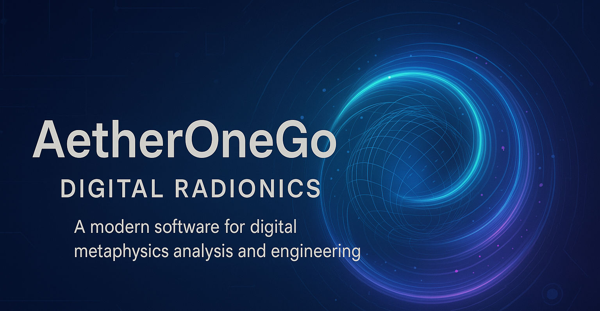

Open Source Radionics written in Golang and three.js

# Download
I will release compiled versions for different operating systems [here](https://github.com/isuretpolos/AetherOneGo/releases/latest).

# Versions
- 0.2.3 Shadows bugfix
- 0.2.0 Three.js / Vite / UI embedded in Go
- 0.1.0 GoReleaser

# Developers
Please refer to the [Go](go/README.md) and [Ui](go/ui/README.md) documentation.

# Patreon
Please support me on [Patreon](https://www.patreon.com/c/aetherone) if you like my work. I will release more features and updates in the future. I am also open for suggestions and ideas. Please contact me via email or Discord. And you can use Github discussions for feature requests and bug reports.

